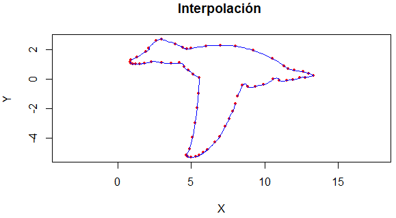

# Taller_Interpolacion_Pato
## Datos o Nodos
A continuacion se presentaran las coordenadas que representan la figura del pato, estan representadas mediante dos arreglos a traves del programa R Studio.
```
x = c(0.9, 1.3, 1.9, 2.1, 2.6, 3.0, 3.9, 4.4, 4.7, 5, 6.0, 7.0, 8.0, 9.2, 
      10.5, 11.3, 11.6, 12.0, 12.6, 13.0, 13.3,0.817, 0.897, 1.022, 1.191,
      1.510, 1.834, 2.264, 2.962, 3.624, 4.202, 4.499, 4.779, 5.109, 5.527,
      4.659, 4.865, 5.085, 5.261, 5.387, 5.478, 5.527,4.659, 4.750, 4.990, 
      5.289, 5.560, 5.839, 6.113, 6.606, 6.916, 7.305, 7.563, 7.802, 7.983,
      8.141, 8.473, 8.832, 9.337, 9.887, 10.572, 10.995, 11.501, 11.923, 
      12.364, 12.763, 13.300)

y = c(1.3, 1.5, 1.85, 2.1, 2.6, 2.7, 2.4, 2.15, 2.05, 2.1, 2.25, 2.3, 2.25,
      1.95, 1.4, 0.9, 0.7, 0.6, 0.5, 0.4, 0.25, 1.180, 1.065, 1.023, 1.010, 
      1.032, 1.085, 1.192, 1.115, 1.087, 1.100, 0.830, 0.608, 0.350, 0.106, 
      -5.161, -4.741, -3.933, -2.951, -1.970, -0.981, 0.106,-5.161, -5.259, 
      -5.284, -5.268, -5.161, -4.982, -4.769, -4.286, -3.911, -3.213, -2.670,
      -2.176, -1.655, -1.138, -0.434, -0.514, -0.494, -0.382, -0.005, -0.090,
      -0.085, -0.030, 0.093, 0.120, 0.250)
      
plot(x,y, pch=19, cex=0.5, col = "red", asp=1,xlab="X", ylab="Y", main="Diagrama ")

```
Con base en lo anterior, se obtiene la siguiente gráfica unicamente con las coordenadas, antes de realizar la interpolación de la figura. Dicha gráfica hace referencia al Diagrama de Nodos.

<p align="center">
  
</p>

## Metodo de Spline
Ahora bien, para realizar la interpolación se utiliza el algoritmo de spline presentado a continuación.}

```
cubicSpline = function(x,y) {
  a = rep(y)
  n = length(x)
  1
  h <- (c(x,0) - c(0,x))[2:n]
  alph <- (3/c(1,h,1,1)*(c(a,1,1) - c(1,a,1)) - 3/c(1,1,h,1)*(c(1,a,1)-c(1,1,a)))[3:n]
  A <- c(1,rep(0,times=n-1))
  for (i in 1:(n-2)) {
    A <- rbind(A,c( rep(0,times=i-1) , c(h[i],2*(h[i]+h[i+1]),h[i+1]) , rep(0,times=n-i-2) ) )
  }
  A <- rbind(A,c(rep(0,times=n-1),1))
  b <- c(0,alph,0)
  c <- solve(A, b)
  b <- ((c(a,0) - c(0,a))/c(1,h,1) - c(1,h,1)/3*(c(c,0) + 2*c(0,c)))[2:n]
  d <- ((c(c,0) - c(0,c))/(3*c(1,h,1)))[2:n]
  ans = rbind(a[1:n-1],b,c[1:n-1],d)
}
draw = function(x,y) {
  t = 1:length(x)
  sx = cubicSpline(t,x)
  sy = cubicSpline(t,y)
  for (i in 1:(length(t)-1)) {
    dat<- data.frame(t=seq(t[i],t[i+1], by=0.1) )
    fx <- function(x) (sx[1,i] + sx[2,i]*(x-t[i]) + sx[3,i]*(x-t[i])^2 + sx[4,i]*(x-t[i]))
    fy <- function(x) (sy[1,i] + sy[2,i]*(x-t[i]) + sy[3,i]*(x-t[i])^2 + sy[4,i]*(x-t[i]))
    dat$y=fy(dat$t)
    dat$x=fx(dat$t)
    points(dat$x,dat$y,type='l', col='blue')
  }
}

```
Estas dos funciones se llaman luego de haberse graficado el diagrama de nodos, se llaman de la siguiente forma:

```
cubicSpline(x,y)
draw(x[1:21],y[1:21]) # Perfil Superior del pato
draw(x[22:35],y[22:35]) # Perfil inferior cabeza
draw(x[36:42],y[36:42]) # Perfil Ala superior
draw(x[43:55],y[43:55]) # Perfil Ala inferior
draw(x[56:67],y[56:67]) # Perfil inferior posterior
```
Por lo que se puede ver, la función draw se llama varias veces, ya que cada llamado hace referencia a cierta parte fundamental de la figura del pato, esta función se llama repetidas veces con la finalidad de obtener la correcta gráfica de la interpolación.

A continuación se presenta la gráfica:

<p align="center">
  
</p>

