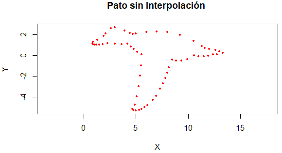

# Taller_Interpolacion_Pato
## Datos o Nodos
A continuacion se presentaran las coordenadas que representan la figura del pato, estan representadas mediante dos arreglos a traves del programa R Studio.
```
x = c(0.9, 1.3, 1.9, 2.1, 2.6, 3.0, 3.9, 4.4, 4.7, 5, 6.0, 7.0, 8.0, 9.2, 
      10.5, 11.3, 11.6, 12.0, 12.6, 13.0, 13.3,0.817, 0.897, 1.022, 1.191,
      1.510, 1.834, 2.264, 2.962, 3.624, 4.202, 4.499, 4.779, 5.109, 5.527,
      4.659, 4.865, 5.085, 5.261, 5.387, 5.478, 5.527,4.659, 4.750, 4.990, 
      5.289, 5.560, 5.839, 6.113, 6.606, 6.916, 7.305, 7.563, 7.802, 7.983,
      8.141, 8.473, 8.832, 9.337, 9.887, 10.572, 10.995, 11.501, 11.923, 
      12.364, 12.763, 13.300)

y = c(1.3, 1.5, 1.85, 2.1, 2.6, 2.7, 2.4, 2.15, 2.05, 2.1, 2.25, 2.3, 2.25,
      1.95, 1.4, 0.9, 0.7, 0.6, 0.5, 0.4, 0.25, 1.180, 1.065, 1.023, 1.010, 
      1.032, 1.085, 1.192, 1.115, 1.087, 1.100, 0.830, 0.608, 0.350, 0.106, 
      -5.161, -4.741, -3.933, -2.951, -1.970, -0.981, 0.106,-5.161, -5.259, 
      -5.284, -5.268, -5.161, -4.982, -4.769, -4.286, -3.911, -3.213, -2.670,
      -2.176, -1.655, -1.138, -0.434, -0.514, -0.494, -0.382, -0.005, -0.090,
      -0.085, -0.030, 0.093, 0.120, 0.250)
      
plot(x,y, pch=19, cex=0.5, col = "red", asp=1,xlab="X", ylab="Y", main="Diagrama ")

```


<a href="https://www.codecogs.com/eqnedit.php?latex=P(x)=7x^{5}+6x^{4}-6x^{3}+3x-4" target="_blank"></a>

<a href="https://www.codecogs.com/eqnedit.php?latex=x0=3" target="_blank"></a>

A través de la implementación del método de horner en Python, se obtuvieron los siguientes resutados.

Con <a href="https://www.codecogs.com/eqnedit.php?latex=x0=3" target="_blank"></a>

Para el polinomio: <a href="https://www.codecogs.com/eqnedit.php?latex=P(x)=7x^{5}+6x^{4}-6x^{3}+3x-4" target="_blank"></a>

Se obtuvo como resultado: 2030 y como mínimo número de operaciones: 10

Para la primera derivada: <a href="https://www.codecogs.com/eqnedit.php?latex=P'(x)=35x^4+24x^3-18x^2+3" target="_blank"></a>

Se obtuvo como resultado: 3324 y como mínimo número de operaciones: 8

Para la segunda derivada: <a href="https://www.codecogs.com/eqnedit.php?latex=P''(x)=140x^3+72x^2-36x" target="_blank"></a>

Se obtuvo como resultado: 4320 y como mínimo número de operaciones: 6

Para la tercera derivada: <a href="https://www.codecogs.com/eqnedit.php?latex=P'''(x)=420x^2+144x-36" target="_blank"></a>

Se obtuvo como resultado: 4176 y como mínimo número de operaciones: 4

Para la cuarta derivada: <a href="https://www.codecogs.com/eqnedit.php?latex=P''''(x)=840x+144" target="_blank"></a>

Se obtuvo como resultado: 2664 y como mínimo número de operaciones: 2

## Punto 2. 

Se necesita un recipiente rectangular, sin tapa, de un litro de capacidad. Para construirlo se debe usar una lámina rectangular de 32 cm de largo y 24 cm de ancho. El procedimiento será recortar un cuadrado idéntico en cada una de las cuatro esquinas y doblar los bordes de la lámina para formar el recipiente. 

El código determina la medida del lado del cuadrado que se debe recortar en cada esquina para que el recipiente tenga la capacidad requerida. 

**Solución:** 

Un esquema del problema es como el que se muestra en la figura a continuación: 

<p align="center">
  
</p>

El volumen de la caja se puede obtener mediante la siguiente expresión:

<a href="https://www.codecogs.com/eqnedit.php?latex=V(x)=x(0.24-x)(0.32-x)" target="_blank"></a>

Luego, basta con resolver la siguiente ecuación: 

<a href="https://www.codecogs.com/eqnedit.php?latex=V(x)=x(0.24-x)(0.32-x)" target="_blank"></a>

Para resolver el problema, se debe tener en cuenta que el volumen solamente puede aproximarse por la izquierda al valor equivalente a un litro, para eso se le restará un valor de épsilon que permita aproximarse a la solución por la izquierda, resolvimos el problema mediante el método de Bisecciones y Newton Raphson. 

**Resultados método Bisecciones:** 

```
Intervalo: [0,0.05]

 x  = 0.016962500000000012
Vol = 0.0009999886616640628

Intervalo: [0.05,0.1]

 x  = 0.0809325
Vol = 0.0009999921144448125

Intervalo: [0.1,0.15]

 x  = 0.18210500000000004
Vol = 0.0009999975752305029

```

**Resultados método Newton-Raphson:** 
```
 x  = 0.0.01696064362425921
Vol = 0.0009999102141617382

 x  = 0.08093306077072439
Vol = 0.0009999775971849495

 x  = 0.18210497416831156
Vol = 0.0009999958488588572

```

Graficamente: 

<p align="center">
  
</p>

**Preguntas Adicionales:**
